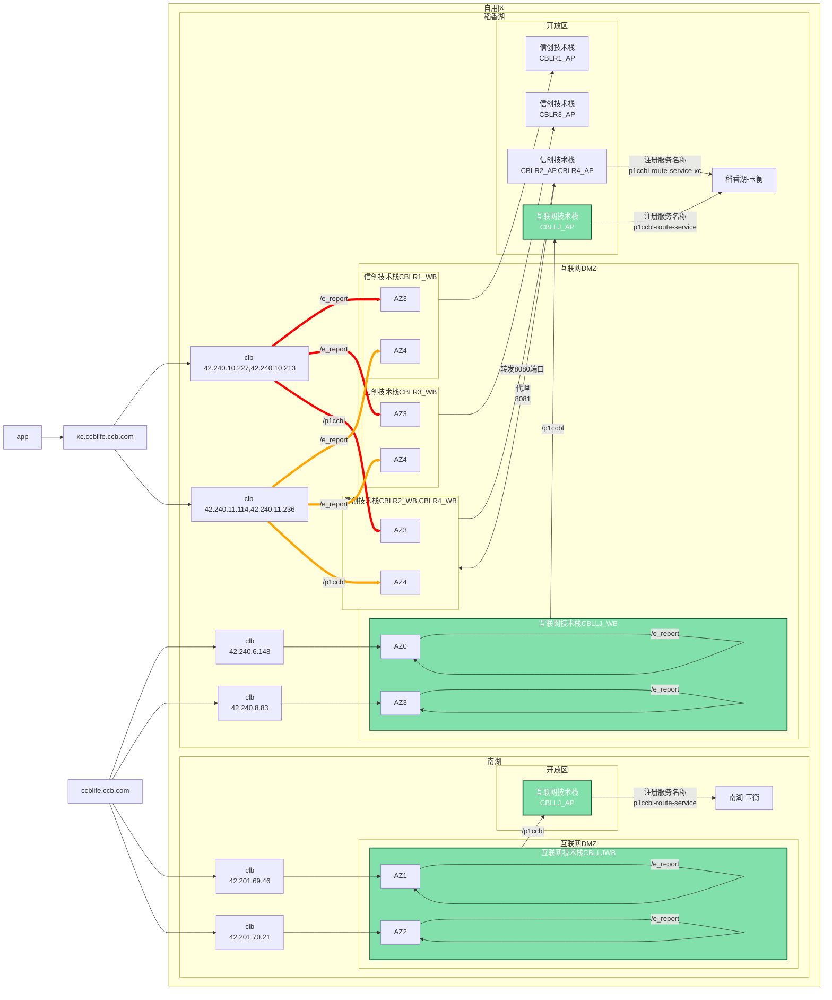

```mermaid
flowchart LR
    app

    信创技术栈域名[xc.ccblife.ccb.com]
    互联网技术栈域名[ccblife.ccb.com]

    subgraph 自用区

        subgraph 稻香湖

            稻香湖-clb_AZ3[clb <br>42.240.10.227,42.240.10.213]
            稻香湖-clb_AZ4[clb <br>42.240.11.114,42.240.11.236]
            
            稻香湖-clb_AZ0[clb <br>42.240.6.148]
            稻香湖-clb_AZ_3[clb <br>42.240.8.83]
            
            稻香湖-玉衡
            subgraph 稻香湖互联网DMZ[互联网DMZ]
                
                CBLR1_WB[信创技术栈<br>CBLR1_WB]
                CBLR3_WB[信创技术栈<br>CBLR3_WB]
                CBLR2/4_WB[信创技术栈<br>CBLR2_WB,CBLR4_WB]

                subgraph CBLR1_WB[信创技术栈CBLR1_WB]
                    CBLR1_WB_AZ3[AZ3]
                    CBLR1_WB_AZ4[AZ4]
                end
                subgraph CBLR3_WB[信创技术栈CBLR3_WB]
                    CBLR3_WB_AZ3[AZ3]
                    CBLR3_WB_AZ4[AZ4]
                end
                subgraph CBLR2/4_WB[信创技术栈CBLR2_WB,CBLR4_WB]
                    CBLR2/4_WB_AZ3[AZ3]
                    CBLR2/4_WB_AZ4[AZ4]
                end
                subgraph 稻香湖_CBLLJ_WB[互联网技术栈CBLLJ_WB]
                    稻香湖_CBLLJ_WB_AZ0[AZ0]
                    稻香湖_CBLLJ_WB_AZ3[AZ3]
                end


            end
            subgraph 稻香湖开放区[开放区]
                CBLR1_AP[信创技术栈<br>CBLR1_AP]
                CBLR3_AP[信创技术栈<br>CBLR3_AP]
                CBLR2/4_AP[信创技术栈<br>CBLR2_AP,CBLR4_AP]


                稻香湖_CBLL1_AP[互联网技术栈<br>CBLLJ_AP]
            end

        end

        subgraph 南湖
            南湖-clb_AZ1[clb<br>42.201.69.46]
            南湖-clb_AZ2[clb<br>42.201.70.21]
            南湖-玉衡

            subgraph 南湖互联网DMZ[互联网DMZ]

                subgraph 南湖_CBLLJ_WB[互联网技术栈CBLLJWB]

                    南湖_CBLLJ_WB_AZ1[AZ1]
                    南湖_CBLLJ_WB_AZ2[AZ2]
                end

            end
            subgraph 南湖开放区[开放区]
                南湖_CBLL1_AP[互联网技术栈<br>CBLLJ_AP]
            end
        end
    end

    app-->信创技术栈域名
    信创技术栈域名-->稻香湖-clb_AZ3
    信创技术栈域名-->稻香湖-clb_AZ4

    稻香湖-clb_AZ3-->|/e_report|CBLR1_WB_AZ3
    稻香湖-clb_AZ3-->|/e_report|CBLR3_WB_AZ3
    稻香湖-clb_AZ3-->|/p1ccbl|CBLR2/4_WB_AZ3
    稻香湖-clb_AZ4-->|/e_report|CBLR1_WB_AZ4
    稻香湖-clb_AZ4-->|/e_report|CBLR3_WB_AZ4
    稻香湖-clb_AZ4-->|/p1ccbl|CBLR2/4_WB_AZ4

    稻香湖_CBLLJ_WB_AZ0-->|/e_report|稻香湖_CBLLJ_WB_AZ0
    稻香湖_CBLLJ_WB_AZ3-->|/e_report|稻香湖_CBLLJ_WB_AZ3
    
    互联网技术栈域名-->稻香湖-clb_AZ0
    互联网技术栈域名-->稻香湖-clb_AZ_3
    稻香湖-clb_AZ0-->稻香湖_CBLLJ_WB_AZ0
    稻香湖-clb_AZ_3-->稻香湖_CBLLJ_WB_AZ3

    linkStyle 3 stroke:red,stroke-width:5px
    linkStyle 4 stroke:red,stroke-width:5px
    linkStyle 5 stroke:red,stroke-width:5px

    linkStyle 6 stroke:orange,stroke-width:5px
    linkStyle 7 stroke:orange,stroke-width:5px
    linkStyle 8 stroke:orange,stroke-width:5px

    CBLR1_WB-->CBLR1_AP
    CBLR3_WB-->CBLR3_AP
    CBLR2/4_WB-->|转发8080端口|CBLR2/4_AP
    CBLR2/4_AP-->|注册服务名称<br>p1ccbl-route-service-xc|稻香湖-玉衡
    CBLR2/4_AP-->|代理<br>8081|CBLR2/4_WB

    稻香湖_CBLLJ_WB-->|/p1ccbl|稻香湖_CBLL1_AP

    稻香湖_CBLL1_AP-->|注册服务名称<br>p1ccbl-route-service|稻香湖-玉衡


    互联网技术栈域名-->南湖-clb_AZ1
    互联网技术栈域名-->南湖-clb_AZ2

    南湖-clb_AZ1-->南湖_CBLLJ_WB_AZ1
    南湖-clb_AZ2-->南湖_CBLLJ_WB_AZ2

    南湖_CBLLJ_WB-->|/p1ccbl|南湖_CBLL1_AP
    
    南湖_CBLLJ_WB_AZ1-->|/e_report|南湖_CBLLJ_WB_AZ1
    南湖_CBLLJ_WB_AZ2-->|/e_report|南湖_CBLLJ_WB_AZ2
    
    南湖_CBLL1_AP-->|注册服务名称<br>p1ccbl-route-service|南湖-玉衡


    classDef darkGreen fill:#82e0aa,stroke:#145a32,stroke-width:2px,color:#fff

    class 南湖_CBLLJ_WB,南湖_CBLL1_AP,稻香湖_CBLLJ_WB,稻香湖_CBLL1_AP darkGreen
    
```

