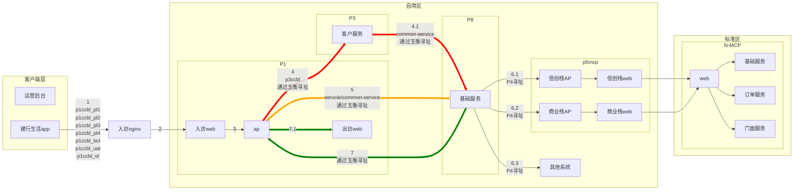

```mermaid
flowchart LR
    subgraph 客户端层
        Web[运营后台]
        App[建行生活app]
    end

    Nginx[入访nginx]
    
    subgraph  自用区
        direction LR
        subgraph P1
            P1_INPUT_WB[入访web]
            P1_AP[ap]
            P1_OUTPUT_WB[出访web]
        end
        
        
        subgraph P8
            COMMON[基础服务]
        end
        subgraph p5mcp
            MCPDJ_WB[信创栈web]
            MCPDJ_AP[信创栈AP]
            MCPNH_WB[商业栈web]
            MCPNH_AP[商业栈AP]
        end
        subgraph P3
            CUST[客户服务]
        end

        其他系统[其他系统]
        
    end
    subgraph 标准区
        subgraph N-MCP
            web
            clp_service[基础服务]
            clp_order[订单服务]
            basic_service[门面服务]
        end
    end
    
    
    App -->|1<br>p1ccbl_pl1<br>p1ccbl_pl2<br>p1ccbl_pl3<br>p1ccbl_pl4<br>p1ccbl_bct<br>p1ccbl_uat<br>p1ccbl_vt|Nginx
    Nginx-->|2|P1_INPUT_WB
    P1_INPUT_WB-->|3|P1_AP
    P1_AP-->|4<br>p3ccbl<br>通过玉衡寻址|CUST
    P1_AP-->|5<br>servcie/common-service<br>通过玉衡寻址|COMMON
    CUST-->|4.1<br>common-service<br>通过玉衡寻址|COMMON
    COMMON-->|6.1<br>P4寻址|MCPDJ_AP
    COMMON-->|6.2<br>P4寻址|MCPNH_AP
    COMMON-->|6.3<br>P4寻址|其他系统
    MCPDJ_AP-->MCPDJ_WB
    MCPNH_AP-->MCPNH_WB
    MCPDJ_WB-->web
    MCPNH_WB-->web
    web-->clp_service
    web-->clp_order
    web-->basic_service
    COMMON-->|7<br>通过玉衡寻址|P1_AP
    P1_AP-->|7.1<br>|P1_OUTPUT_WB

    linkStyle 3 stroke:red,stroke-width:5px
    linkStyle 5 stroke:red,stroke-width:5px
    linkStyle 4 stroke:orange,stroke-width:5px
    linkStyle 16 stroke:green,stroke-width:5px
    linkStyle 17 stroke:green,stroke-width:5px
```
# 1.需要整改的内容
- (1)序号1的链路转发的路径需要改为【p1ccbl_环境】的格式.
- (2)pl目前只有pl4,vt环境的机器，需要申请其他环境的入访web,ap
- (3)pl目前没有出访的web的机器，需要申请各个环境的机器

