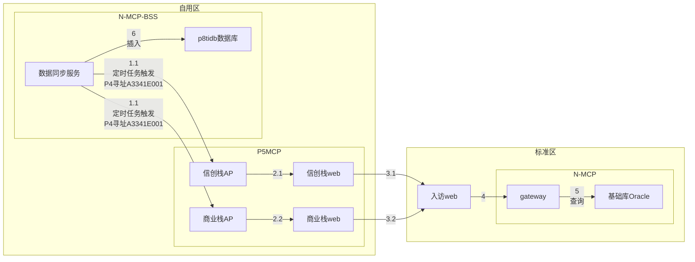

# 测试与生产配置差异

- 生产接入CLB:10.206.194.11:8199,测试环境无CLB

- sync-serv寻址p5mcpA3341E001交易、 p5mcp->n-mcp使用svcId:API-GATEWAY-001（测试环境通过lua脚本识别svcId转发至gateway）

- 测试环境配置*p5.switchOff=true* 时，可跳过p5直接请求gateway,请求地址为*sync.http.url* 配置项（不建议使用）
