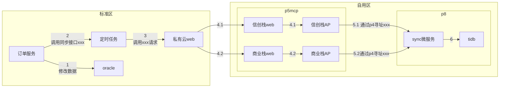
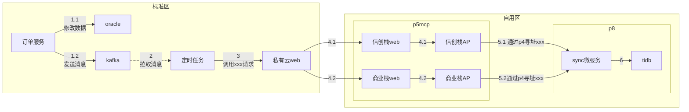
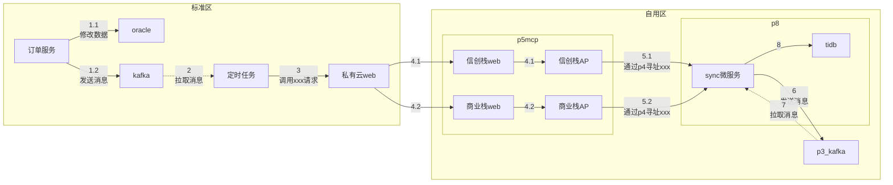
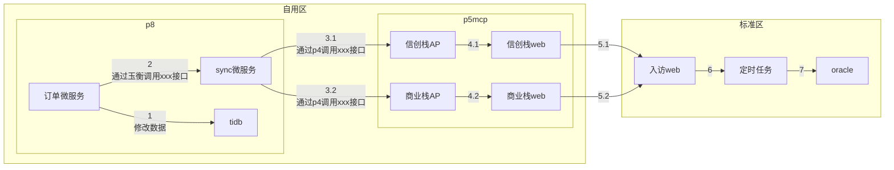
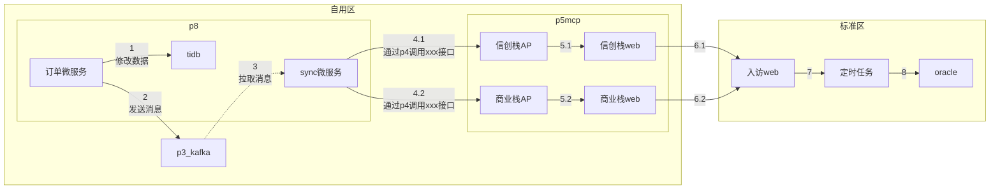
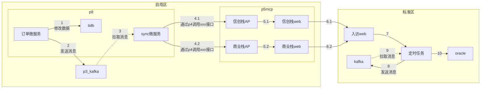

# 1.标准区同步到自用区
## 1.1 同步调用

```mermaid
flowchart LR
    subgraph 标准区
        clp_order[订单服务]
        cld_data_sync[定时任务]
        oracle
        私有云web
    end
    subgraph 自用区
        subgraph p5mcp
            MCPDJ_WB[信创栈web]
            MCPDJ_AP[信创栈AP]
            MCPNH_WB[商业栈web]
            MCPNH_AP[商业栈AP]
        end
        subgraph p8
            nmcp_micro_sync[sync微服务]
            tidb
        end
    end

    clp_order-->| 1<br>修改数据|oracle
    clp_order-->| 2<br>调用同步接口xxx|cld_data_sync
    cld_data_sync-->| 3<br>调用xxx请求|私有云web
    私有云web-->|4.1|MCPDJ_WB
    私有云web-->|4.2|MCPNH_WB
    MCPDJ_WB-->|4.1|MCPDJ_AP
    MCPNH_WB-->|4.2|MCPNH_AP
    MCPDJ_AP-->|5.1 通过p4寻址xxx|nmcp_micro_sync
    MCPNH_AP-->|5.2通过p4寻址xxx|nmcp_micro_sync
    nmcp_micro_sync-->|6|tidb
    
```
## 1.2异步调用

```mermaid
flowchart LR
    subgraph 标准区
        clp_order[订单服务]
        cld_data_sync[定时任务]
        oracle
        私有云web
        kafka
    end
    subgraph 自用区
        subgraph p5mcp
            MCPDJ_WB[信创栈web]
            MCPDJ_AP[信创栈AP]
            MCPNH_WB[商业栈web]
            MCPNH_AP[商业栈AP]
        end
        subgraph p8
            nmcp_micro_sync[sync微服务]
            tidb
        end
    end

    clp_order-->| 1.1<br>修改数据|oracle
    clp_order-->| 1.2<br>发送消息|kafka
    kafka-.->|2<br>拉取消息|cld_data_sync
    cld_data_sync-->|3<br>调用xxx请求|私有云web
    私有云web-->|4.1|MCPDJ_WB
    私有云web-->|4.2|MCPNH_WB
    MCPDJ_WB-->|4.1|MCPDJ_AP
    MCPNH_WB-->|4.2|MCPNH_AP
    MCPDJ_AP-->|5.1 通过p4寻址xxx|nmcp_micro_sync
    MCPNH_AP-->|5.2通过p4寻址xxx|nmcp_micro_sync
    nmcp_micro_sync-->|6|tidb
    
```

## 1.3 异步kafka调用

```mermaid
flowchart LR
    subgraph 标准区
        clp_order[订单服务]
        cld_data_sync[定时任务]
        oracle
        私有云web
        kafka
    end
    subgraph 自用区
        subgraph p5mcp
            MCPDJ_WB[信创栈web]
            MCPDJ_AP[信创栈AP]
            MCPNH_WB[商业栈web]
            MCPNH_AP[商业栈AP]
        end
        subgraph p8
            nmcp_micro_sync[sync微服务]
            tidb
        end
        p3_kafka
    end

    clp_order-->| 1.1<br>修改数据|oracle
    clp_order-->| 1.2<br>发送消息|kafka
    kafka-.->|2<br>拉取消息|cld_data_sync
    cld_data_sync-->|3<br>调用xxx请求|私有云web
    私有云web-->|4.1|MCPDJ_WB
    私有云web-->|4.2|MCPNH_WB
    MCPDJ_WB-->|4.1|MCPDJ_AP
    MCPNH_WB-->|4.2|MCPNH_AP
    MCPDJ_AP-->|5.1<br>通过p4寻址xxx|nmcp_micro_sync
    MCPNH_AP-->|5.2<br>通过p4寻址xxx|nmcp_micro_sync
    nmcp_micro_sync -->|6<br>发送消息|p3_kafka
    p3_kafka-.->|7<br>拉取消息|nmcp_micro_sync
    nmcp_micro_sync-->|8|tidb
    
```
# 2自用区同步到标准区
## 2.1同步调用

```mermaid
flowchart LR
    subgraph 标准区
        
        cld_data_sync[定时任务]
        oracle
        入访web
    end
    subgraph 自用区
        direction LR
        subgraph p5mcp
            MCPDJ_WB[信创栈web]
            MCPDJ_AP[信创栈AP]
            MCPNH_WB[商业栈web]
            MCPNH_AP[商业栈AP]
        end
        
        subgraph p8
            micro_order_service[订单微服务]
            nmcp_micro_sync[sync微服务]
            tidb
        end
    end

    micro_order_service-->| 1<br>修改数据|tidb
    micro_order_service-->| 2<br>通过玉衡调用xxx接口|nmcp_micro_sync
    nmcp_micro_sync-->|3.1<br>通过p4调用xxx接口|MCPDJ_AP
    nmcp_micro_sync-->|3.2<br>通过p4调用xxx接口|MCPNH_AP
    MCPDJ_AP-->|4.1|MCPDJ_WB
    MCPNH_AP-->|4.2|MCPNH_WB
    MCPDJ_WB-->|5.1|入访web
    MCPNH_WB-->|5.2|入访web
    入访web-->|6|cld_data_sync
    cld_data_sync-->|7|oracle
    
```

## 2.2异步调用

```mermaid
flowchart LR
    subgraph 标准区
        
        cld_data_sync[定时任务]
        oracle
        入访web
    end
    subgraph 自用区
        direction LR
        p3_kafka
        subgraph p5mcp
            MCPDJ_WB[信创栈web]
            MCPDJ_AP[信创栈AP]
            MCPNH_WB[商业栈web]
            MCPNH_AP[商业栈AP]
        end
        
        subgraph p8
            micro_order_service[订单微服务]
            nmcp_micro_sync[sync微服务]
            tidb
        end
    end

    micro_order_service-->| 1<br>修改数据|tidb
    micro_order_service-->| 2<br>发送消息|p3_kafka
    p3_kafka-.->| 3<br>拉取消息|nmcp_micro_sync
    nmcp_micro_sync-->|4.1<br>通过p4调用xxx接口|MCPDJ_AP
    nmcp_micro_sync-->|4.2<br>通过p4调用xxx接口|MCPNH_AP
    MCPDJ_AP-->|5.1|MCPDJ_WB
    MCPNH_AP-->|5.2|MCPNH_WB
    MCPDJ_WB-->|6.1|入访web
    MCPNH_WB-->|6.2|入访web
    入访web-->|7|cld_data_sync
    cld_data_sync-->|8|oracle

```

## 2.3异步kafka调用

```mermaid
flowchart LR
    subgraph 标准区
        kafka
        cld_data_sync[定时任务]
        oracle
        入访web
    end
    subgraph 自用区
        direction LR
        p3_kafka
        subgraph p5mcp
            MCPDJ_WB[信创栈web]
            MCPDJ_AP[信创栈AP]
            MCPNH_WB[商业栈web]
            MCPNH_AP[商业栈AP]
        end
        
        subgraph p8
            micro_order_service[订单微服务]
            nmcp_micro_sync[sync微服务]
            tidb
        end
    end

    micro_order_service-->| 1<br>修改数据|tidb
    micro_order_service-->| 2<br>发送消息|p3_kafka
    p3_kafka-.->| 3<br>拉取消息|nmcp_micro_sync
    nmcp_micro_sync-->|4.1<br>通过p4调用xxx接口|MCPDJ_AP
    nmcp_micro_sync-->|4.2<br>通过p4调用xxx接口|MCPNH_AP
    MCPDJ_AP-->|5.1|MCPDJ_WB
    MCPNH_AP-->|5.2|MCPNH_WB
    MCPDJ_WB-->|6.1|入访web
    MCPNH_WB-->|6.2|入访web
    入访web-->|7|cld_data_sync
    cld_data_sync-->|8<br>发送消息|kafka
    kafka -.->|9<br>拉取消息|cld_data_sync
    cld_data_sync-->|10|oracle
```
