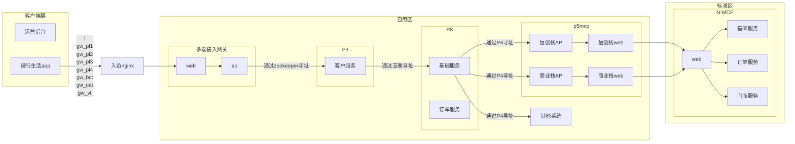

```mermaid
flowchart LR
    subgraph 客户端层
        Web[运营后台]
        App[建行生活app]
    end

    Nginx[入访nginx]
    
    subgraph  自用区
        subgraph 多端接入网关
            CCMPS_WB[web]
            CCMPS_AP[ap]
        end
        
        subgraph P3
            CUST[客户服务]
        end
        subgraph P8
            COMMON[基础服务]
            ORDER[订单服务]
        end
        subgraph p5mcp
            MCPDJ_WB[信创栈web]
            MCPDJ_AP[信创栈AP]
            MCPNH_WB[商业栈web]
            MCPNH_AP[商业栈AP]
        end
        其他系统[其他系统]
    end
    subgraph 标准区
        subgraph N-MCP
            web
            clp_service[基础服务]
            clp_order[订单服务]
            basic_service[门面服务]
        end
    end
    
    
    App -->|1<br>gw_pl1<br>gw_pl2<br>gw_pl3<br>gw_pl4<br>gw_bct<br>gw_uat<br>gw_vt|Nginx
    Nginx-->CCMPS_WB
    CCMPS_WB-->CCMPS_AP
    CCMPS_AP-->|通过zookeeper寻址|CUST
    CUST-->|通过玉衡寻址|COMMON
    COMMON-->|通过P4寻址|MCPDJ_AP
    COMMON-->|通过P4寻址|MCPNH_AP
    COMMON-->|通过P4寻址|其他系统
    MCPDJ_AP-->MCPDJ_WB
    MCPNH_AP-->MCPNH_WB
    MCPDJ_WB-->web
    MCPNH_WB-->web
    web-->clp_service
    web-->clp_order
    web-->basic_service
```
# 1.需要整改的内容
- (1)序号1的链路转发的路径需要改为【gw_环境】的格式.
- (2)多端接入网关只是给了 pl2环境的机器，需要找他们再提供其他环境的机器

