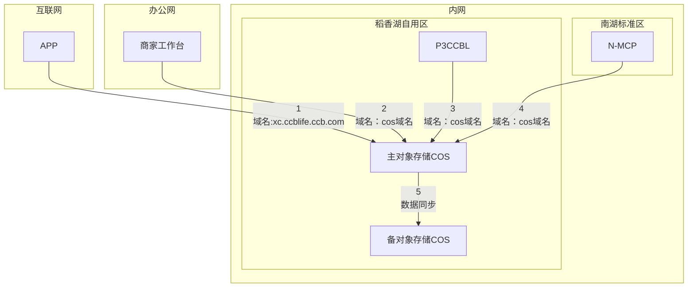
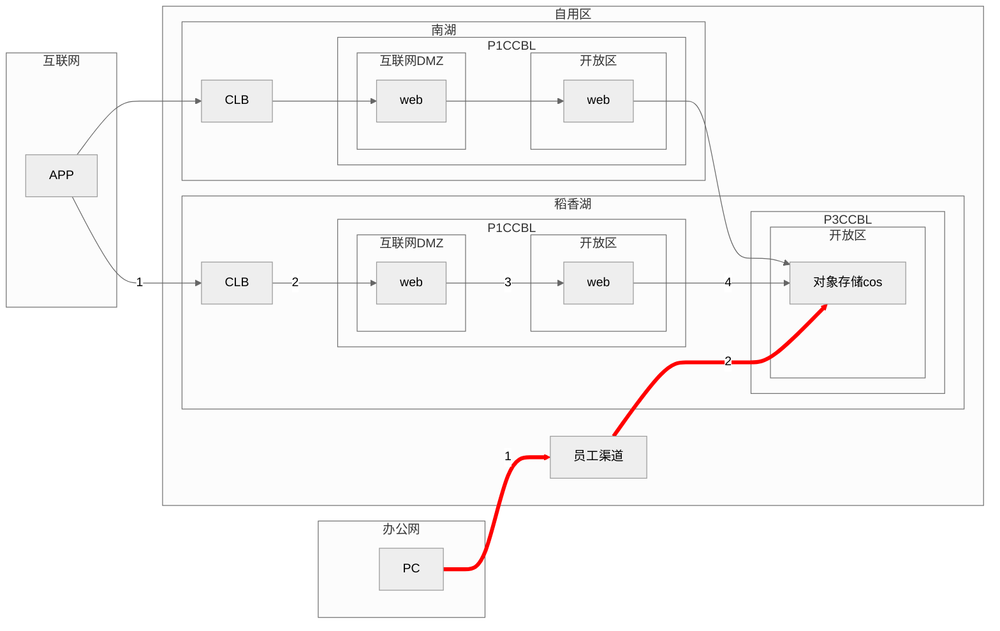
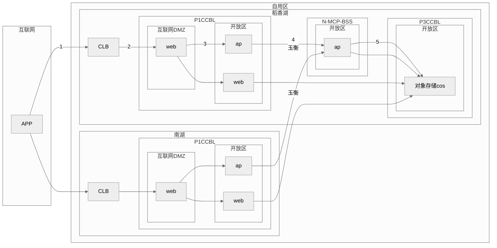
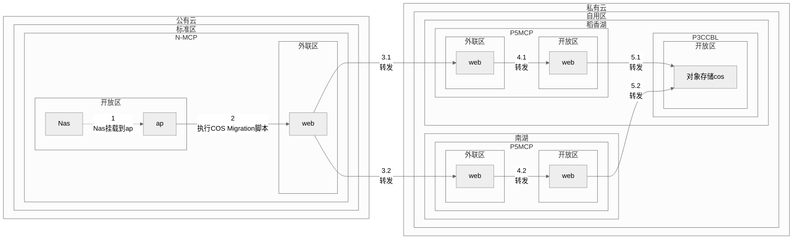

互联网要访问互联DMZ的CLB， 办公网访问开放CLB，内网访问开放区，标准区访问外联DMZ

### 链路 1
待cos确认操作：需要cos进行映射项目组对外的域名。 
网络确认：互联网的域名映射cos域名是否涉及网络关系开通
### 链路 2
网络确认：办公网到cos域名的网络关系
### 链路 3
网络确认：稻香湖自用区AP到cos域名的网络关系
### 链路 4
待cos确认操作：南湖中心能通过cos域名跨区访问稻香湖自用区的cos吗？ 
网络确认：南湖标准区AP到cos域名的网络关系
### 链路 5
待cos确认操作：主桶跟备桶的同步方式

获取临时密钥的链路

标准区存量数据同步到自用区的链路

# 最终版本的链路

