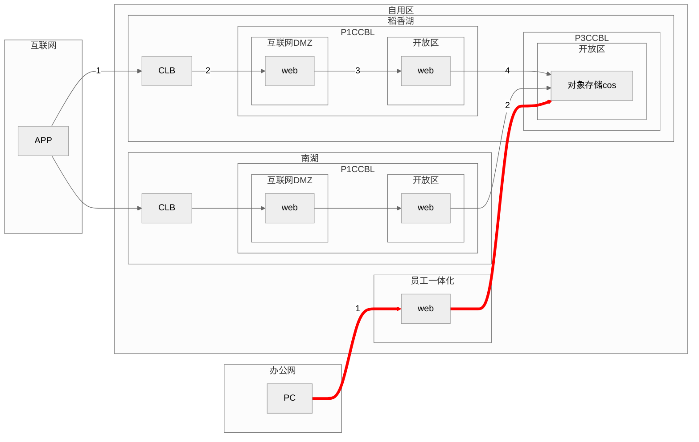
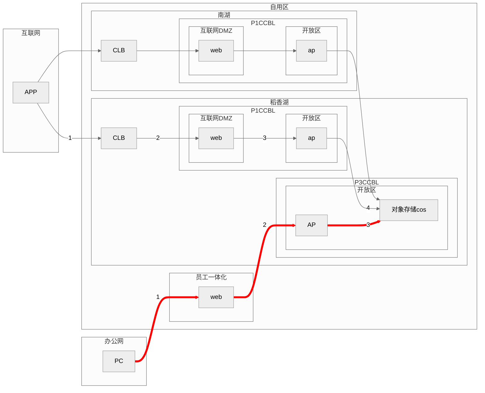

# 最终版本读取链路

```mermaid
%%{init: {'theme': 'neutral'}}%%
flowchart LR
    subgraph 互联网
        APP
    end
    
    subgraph 办公网 
        PC
    end
    
    subgraph 自用区 
       
        subgraph 员工一体化 
            员工渠道[web]
        end
        
        subgraph 稻香湖
            CLB_D[CLB]
            subgraph P1CCBL_D[P1CCBL]
                subgraph 互联网DMZ_D[互联网DMZ]
                        web_D[web]
                end
                subgraph 开放区_D[开放区]
                        ap_D[web]
                end
            end
            subgraph P3CCBL
                subgraph 开放区_P8[开放区]
                    cos[对象存储cos]
                end
            end
        end
        subgraph 南湖
            CLB_N[CLB]
            subgraph P1CCBL_N[P1CCBL]
                subgraph 互联网DMZ_N[互联网DMZ]
                    web_N[web]
                end
                subgraph 开放区_N[开放区]
                    ap_N[web]
                end
            end
        end
    end
    
    APP-->|1|CLB_D
    CLB_D-->|2|web_D
    web_D-->|3|ap_D
    ap_D-->|4|cos
    APP-->CLB_N
    CLB_N-->web_N
    web_N-->ap_N
    ap_N-->cos
    PC-->|1|员工渠道
    员工渠道-->|2|cos
    
    linkStyle 8 stroke:red,stroke-width:5px
    linkStyle 9 stroke:red,stroke-width:5px
```

# 最终版本写入链路

```mermaid
%%{init: {'theme': 'neutral'}}%%
flowchart LR
    subgraph 互联网
        APP
    end
    
    subgraph 办公网 
        PC
    end
    
    subgraph 自用区 
       
        subgraph 员工一体化 
            员工渠道[web]
        end
        
        subgraph 稻香湖
            CLB_D[CLB]
            subgraph P1CCBL_D[P1CCBL]
                subgraph 互联网DMZ_D[互联网DMZ]
                        web_D[web]
                end
                subgraph 开放区_D[开放区]
                        ap_D[ap]
                end
            end
            subgraph P3CCBL
                subgraph 开放区_P8[开放区]
                    cos[对象存储cos]
                    p3_AP[AP]
                end
            end
        end
        subgraph 南湖
            CLB_N[CLB]
            subgraph P1CCBL_N[P1CCBL]
                subgraph 互联网DMZ_N[互联网DMZ]
                    web_N[web]
                end
                subgraph 开放区_N[开放区]
                    ap_N[ap]
                end
            end
        end
    end
    
    APP-->|1|CLB_D
    CLB_D-->|2|web_D
    web_D-->|3|ap_D
    ap_D-->|4|cos
    APP-->CLB_N
    CLB_N-->web_N
    web_N-->ap_N
    ap_N-->cos
    PC-->|1|员工渠道
    员工渠道-->|2|p3_AP
    p3_AP-->|3|cos
    
    linkStyle 8 stroke:red,stroke-width:5px
    linkStyle 9 stroke:red,stroke-width:5px
    linkStyle 10 stroke:red,stroke-width:5px
```
