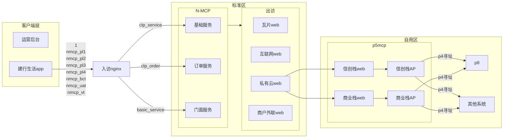

```mermaid
flowchart LR
    subgraph 客户端层
        Web[运营后台]
        App[建行生活app]
    end
    
    Nginx[入访nginx]
    
    subgraph 标准区
        subgraph N-MCP
            clp_service[基础服务]
            clp_order[订单服务]
            basic_service[门面服务]
        end
        subgraph 出访
            瓦片web
            互联网web
            私有云web
            商户外联web
        end
    end
    
    subgraph 自用区
        subgraph p5mcp
            MCPDJ_WB[信创栈web]
            MCPDJ_AP[信创栈AP]
            MCPNH_WB[商业栈web]
            MCPNH_AP[商业栈AP]
        end
        N-MCP-BSS[p8]
        其他系统[其他系统]
    end

    App -->|1<br>nmcp_pl1<br>nmcp_pl2<br>nmcp_pl3<br>nmcp_pl4<br>nmcp_bct<br>nmcp_uat<br>nmcp_vt|Nginx
    Nginx-->|clp_service|clp_service
    Nginx-->|clp_order|clp_order
    Nginx-->|basic_service|basic_service
    N-MCP-->出访
    私有云web-->MCPDJ_WB
    私有云web-->MCPNH_WB
    MCPDJ_WB-->MCPDJ_AP
    MCPNH_WB-->MCPNH_AP

    MCPDJ_AP-->|p4寻址|N-MCP-BSS
    MCPNH_AP-->|p4寻址|N-MCP-BSS

    MCPDJ_AP-->|p4寻址|其他系统
    MCPNH_AP-->|p4寻址|其他系统
    
    
```
# 1.需要整改的内容
- 序号1的链路转发的路径需要改为【nmcp_环境】的格式

