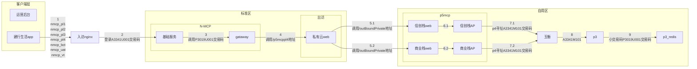

```mermaid
flowchart LR
    subgraph 客户端层
        Web[运营后台]
        App[建行生活app]
    end

    Nginx[入访nginx]

    subgraph 标准区
        subgraph N-MCP
            clp_service[基础服务]
            gataway
        end
        subgraph 出访
            私有云web
        end
       
    end

    subgraph 自用区
        subgraph p5mcp
            MCPDJ_WB[信创栈web]
            MCPDJ_AP[信创栈AP]
            MCPNH_WB[商业栈web]
            MCPNH_AP[商业栈AP]
        end
        P3-CCBL[p3]
        玉衡
        p3_redis
    end

    App -->|1<br>nmcp_pl1<br>nmcp_pl2<br>nmcp_pl3<br>nmcp_pl4<br>nmcp_bct<br>nmcp_uat<br>nmcp_vt|Nginx
    Nginx-->|2<br>登录A3341U001交易码|clp_service
    clp_service-->|3<br>调用P3019U001交易码|gataway
    gataway-->|4<br>调用/p5mcppl4地址|私有云web
    私有云web-->|5.1<br>调用/outBoundPrivate地址|MCPDJ_WB
    私有云web-->|5.2<br>调用/outBoundPrivate地址|MCPNH_WB
    MCPDJ_WB-->|6.1|MCPDJ_AP
    MCPNH_WB-->|6.2|MCPNH_AP

    MCPDJ_AP-->|7.1<br>p4寻址A3341M101交易码|玉衡
    MCPNH_AP-->|7.2<br>p4寻址A3341M101交易码|玉衡
    玉衡-->|8<br>A3341M101|P3-CCBL
    P3-CCBL-->|9<br>小交易码P3019U001交易码|p3_redis
```
