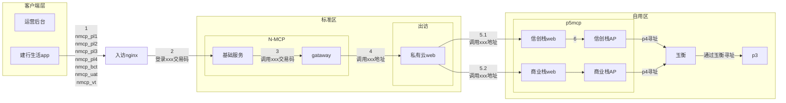

```mermaid
flowchart LR
    subgraph 客户端层
        Web[运营后台]
        App[建行生活app]
    end
    
    Nginx[入访nginx]
    
    subgraph 标准区
        subgraph N-MCP
            clp_service[基础服务]
            gataway
        end
        subgraph 出访
            私有云web
        end
    end
    
    subgraph 自用区
        subgraph p5mcp
            MCPDJ_WB[信创栈web]
            MCPDJ_AP[信创栈AP]
            MCPNH_WB[商业栈web]
            MCPNH_AP[商业栈AP]
        end
        P3-CCBL[p3]
        玉衡
    end

    App -->|1<br>nmcp_pl1<br>nmcp_pl2<br>nmcp_pl3<br>nmcp_pl4<br>nmcp_bct<br>nmcp_uat<br>nmcp_vt|Nginx
    Nginx-->|2<br>登录xxx交易码|clp_service

    clp_service-->|3<br>调用xxx交易码|gataway
    gataway-->|4<br>调用xxx地址|私有云web
    私有云web-->|5.1<br>调用xxx地址|MCPDJ_WB
    私有云web-->|5.2<br>调用xxx地址|MCPNH_WB
    MCPDJ_WB-->|6|MCPDJ_AP
    MCPNH_WB-->MCPNH_AP

    MCPDJ_AP-->|p4寻址|玉衡
    MCPNH_AP-->|p4寻址|玉衡
    玉衡-->|通过玉衡寻址|P3-CCBL

    
    
```

